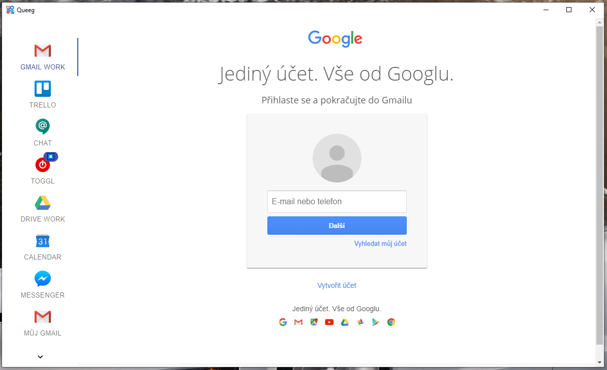
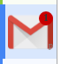

# Queeg

Make from your the best usable websites desktop application customized just for you.

Are you bored that you have everything in one browser?
Do you want have separate context in some 



## Usecases

* Separate application for messeging.
  * For it you can use application [Franz](https://meetfranz.com/).
* Have different context (work and personal accounts) inner one or more windows.
* Set you own icon and name for each window for more organization on your desktop.
  * Work application and Personal application.
  * YouTube application.
* You can show different alerts or notification from each different website.
  * Gmail with unread messages.
  * When Toggle is not running and you use your Gmail.

## Install and run

To clone and run this repository you'll need [Git](https://git-scm.com) and [Node.js](https://nodejs.org/en/download/) (which comes with [npm](http://npmjs.com)) installed on your computer. From your command line:

```bash
# Clone this repository
git clone https://github.com/ingSlonik/queeg
# Go into the repository
cd queeg
# Install dependencies
npm install
# Run the app
npm start
```

## Configuration

Open `./src/configuration.ts` and update it in JSON format.
After update run app again `npm start`.
Recommended IDE is Visual Studio Code, it will be shown your mistakes. 
Otherwise it will be display where is the mistake with run this application.

### Properties

* title
  * Title of application.

* name
  * Name of this website item.

* icon
  * Icon in folder `./img/` for this website item. You can add your own.

* color
  * Color for nice separate group of your websites.

* url
  * URL of your website item.

* partition
  * Separate context of websites by definition in [webview partition](https://electronjs.org/docs/api/webview-tag#partition).

* alert
  * Function for get number of alert displaed in red circle on icon.
  * You can add your own function to `src/alerts.ts`.
  * 

### Example

```js
import { Application } from "./types";

import { alertFromNumber } from "./alerts";

const windows: Array<Application> = [
    {
        title: "Queeg",
        icon: "icon.png",
        items: [
            { 
                name: "gmail_work", 
                icon: "gmail.png", 
                color: "#8aca3a", 
                url: "https://mail.google.com/mail/u/0/#inbox", 
                partition: "persist:work", 
                alert: alertFromNumber 
            }
        ]
    }
];
```